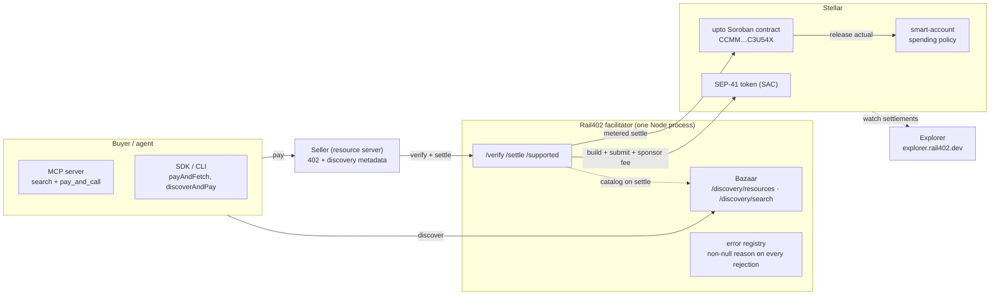

Rail402 is a production x402 facilitator, a Stellar-native Bazaar discovery layer, and the agent tooling around them. This section documents how it is built and how it integrates with Stellar, component by component. Every significant claim links to a live endpoint, a settled transaction on chain, or a file in the source tree.

It runs on `stellar:testnet` today at [`facilitator.rail402.dev`](https://facilitator.rail402.dev/supported), free and with no API key.

<Note>
New here, start with [The Stellar integration](#the-stellar-integration) for the primitive-by-primitive summary, then [Verify it yourself](/architecture/proofs) for the commands that confirm each claim on chain.
</Note>

## The system at a glance

The facilitator and the Bazaar are the **same Node process**. A resource is cataloged only from inside the facilitator's own `/verify` and `/settle` handlers, so a listing always corresponds to a real payment path. The MCP server and the SDK/CLI are separate surfaces that speak to it. The Explorer watches the ledger independently and classifies x402 settlements across every facilitator, not only Rail402's.

## The Stellar integration

Rail402 is not x402 that happens to target Stellar. Every component is built on a specific Stellar primitive. This table lists each piece, the exact Stellar mechanism it uses, and the on-chain proof it works. The deep pages expand each row.

| Rail402 component | Stellar primitive it uses | Proof |
| --- | --- | --- |
| **verify / settle** | Soroban **authorization entries** (CAP-46). The buyer signs an auth entry for a `transfer` on the asset's SAC, and the facilitator builds and submits the invocation. | [`/supported`](https://facilitator.rail402.dev/supported), tx [`3f6031ed…`](https://stellar.expert/explorer/testnet/tx/3f6031ed4d3d17100992b1e003f9bcc6da51ef684cc1ba402432ae52166a903f) |
| **Fee sponsorship** | The facilitator is the **transaction source** and pays `BASE_FEE + minResourceFee` in XLM, so the buyer holds no XLM. | fee charged to the facilitator on chain |
| **Assets** | Any **SEP-41** token through its **Stellar Asset Contract (SAC)**, USDC by default, with 7-decimal stroop integer math. | USDC SAC `CBIELTK6…`, tx [`cfb8c0fd…`](https://stellar.expert/explorer/testnet/tx/cfb8c0fdeec7e54d2becb9ee4e357c291727e121397546f25607333064ca57c1) |
| **`exact` scheme** | An address-credentialed auth entry, and the `payload: { transaction }` base64 XDR envelope accepted as the spec defines it. | [Settlement](/architecture/settlement) |
| **`upto` scheme** | A **Soroban contract** plus a two-node auth tree (a `settle` root and a SAC `approve` sub-invocation) validated by `require_auth_for_args`. | contract [`CCMM3FMG…`](https://stellar.expert/explorer/testnet/contract/CCMM3FMGEH7FHRYXZ3WQDQCTIWDXGZBGW7D4UT7NKH34SUQACYC3U54X), tx [`5e5d862c…`](https://stellar.expert/explorer/testnet/tx/5e5d862c88efe16592aa7a0671c4edb917f415481884ec526b62088ef846cce5) |
| **Smart-account buyers** | `__check_auth` (`C…`) accounts, using OpenZeppelin's audited `stellar-accounts` plus a Rail402 Soroban spending policy. | C-account tx [`168929e9…`](https://stellar.expert/explorer/testnet/tx/168929e9a4282f2ce24991f06ae394ab5fb0600e9c7548a3b0438308f0464c78) |
| **Expiration** | `signatureExpirationLedger`, about 12 ledgers derived from `maxTimeoutSeconds`, and Soroban `temporary()` storage TTL for the `upto` nonce. | [Expiration and replay](/architecture/expiration-replay) |
| **Throughput** | A **channel-account pool** with independent sequence lanes, plus an optional fee-bump. | [Throughput](/architecture/stellar-engineering#throughput) |
| **Trustlines** | A SEP-41 trustline pre-flight via Horizon, and a dedicated rejection code for a missing recipient trustline. | [Trustline pre-flight](/architecture/stellar-engineering#trustline-pre-flight) |
| **Asset identity** | The one-way SAC hash of `(code, issuer, passphrase)`, so a look-alike USDC is distinguishable from the canonical asset. | [Asset identity](/architecture/stellar-engineering#provable-asset-identity) |
| **Discovery** | Listings keyed to a settled payment, SEP-1 `stellar.toml` domain verification, and CAIP-2 network identifiers. | [`/discovery/resources`](https://facilitator.rail402.dev/discovery/resources?limit=2) |
| **Explorer** | Classification of `exact` versus `upto` from Soroban `getTransaction` metadata and SAC `transfer` events. | [explorer.rail402.dev](https://explorer.rail402.dev) |

## The map

This section is organized the way a payment moves, from the settlement path out to discovery, then to the conformance and operations that keep it correct.

| Group | What it covers |
| --- | --- |
| [The settlement path](/architecture/settlement) | Auth entries, build-and-submit, the non-custodial invariant, the `exact` scheme, and the error-enrichment layer |
| [Fee sponsorship and fee ceilings](/architecture/fees) | How the facilitator pays the network fee, and the `MAX_TRANSACTION_FEE_STROOPS` guard |
| [Expiration, replay, and front-running](/architecture/expiration-replay) | Ledger-based expiration, the verify-to-settle race, and replay resistance |
| [The upto scheme and its Soroban contract](/architecture/upto) | The two-node auth tree, and the on-ledger ceiling and single-use guarantees |
| [Smart accounts and spending policies](/architecture/smart-accounts) | `__check_auth` buyers and the reserve-then-reconcile budget policy |
| [Stellar-specific engineering](/architecture/stellar-engineering) | SEP-41 stroop math, trustlines, Soroban resource limits, and channel-account throughput |
| [The discovery trust boundary](/architecture/discovery) | Automatic cataloging, `routeTemplate` validation, ownership bound to settlement, and interoperability |
| [The agent-facing MCP interface](/architecture/mcp) | Structured search and paid-call tools with an enforced spend cap |
| [Retrieval](/architecture/retrieval), [Evaluation](/architecture/evaluation), [Reproduce](/architecture/reproduce) | Bazaar search ranking and how its quality is measured |
| [Wire-level conformance](/architecture/conformance) | Interoperability with stock x402 clients, tested at the wire |
| [Deployment, reliability, and licensing](/architecture/deployment) | Hosted and self-hosted paths, degraded-mode behavior, and the permissive-license gate |

## See it live

Rail402 is deployed, not described. These are the fastest checks to run.

<CardGroup cols={3}>
  <Card title="Facilitator" icon="server" href="https://facilitator.rail402.dev/supported">
    `/supported` returns both schemes on `stellar:testnet` with `areFeesSponsored: true`.
  </Card>
  <Card title="Explorer" icon="compass" href="https://explorer.rail402.dev">
    x402 settlements on Stellar across facilitators, in near real time.
  </Card>
  <Card title="Playground" icon="flask" href="https://playground.rail402.dev">
    Run a payment and watch it settle, in the browser.
  </Card>
  <Card title="Verify it yourself" icon="terminal" href="/architecture/proofs">
    Copy-paste curl commands and the settled-transaction table.
  </Card>
  <Card title="Source" icon="github" href="https://github.com/tolgayayci/rail402">
    The monorepo, Apache-2.0.
  </Card>
  <Card title="Packages" icon="npm" href="/reference/packages">
    Ten `@rail402.dev` packages on npm.
  </Card>
</CardGroup>

## Built on @x402/stellar

Settlement on Stellar is largely solved, so Rail402 builds on the Apache-2.0 [`@x402/stellar`](https://www.npmjs.com/package/@x402/stellar) package rather than reimplementing it. `@x402/stellar` provides the `exact` scheme mechanics and `@x402/core` provides the facilitator registry and the `/supported` shape. On top of that base, Rail402 adds:

- an **error-enrichment layer** that gives every `exact` rejection a non-null human reason the package otherwise leaves empty ([Settlement](/architecture/settlement#auth-entry-validation));
- an **entire second scheme**, `upto`, written from scratch with its own Soroban contract ([upto](/architecture/upto));
- the **Bazaar**, meaning cataloging, integrity, and search, which the base package does not provide ([Discovery](/architecture/discovery));
- the **MCP interface**, the SDK and CLI helpers, the conformance harness, and the Explorer.

The dividing line matters for audit scope: the cryptographic settlement path is the reviewed upstream package, while Rail402's own code is configuration, validation, discovery, and one small non-custodial Soroban contract.

## What is proven, and what remains

Stated plainly, because an honest boundary is more useful than an unqualified claim. All of this is on `stellar:testnet`.

**Proven on chain today:**

- `exact` and `upto` settling from both classic (`G…`) keypairs and `__check_auth` (`C…`) smart accounts, across ten published transaction hashes ([Verify it yourself](/architecture/proofs)).
- Fee sponsorship and the non-custodial invariant, visible on ledger: the fee is charged to the facilitator, and the transfer `from` is never the transaction source.
- Automatic cataloging bound to settlement, and natural-language search, live on the deployed Bazaar.
- Interoperability with unmodified stock x402 clients, including two settlements in real testnet USDC driven by the upstream test suite ([Conformance](/architecture/conformance)).

**Work that remains:**

- A third-party security review. Shipping a Soroban contract for `upto` widens the review scope beyond a pure off-chain service ([Deployment](/architecture/deployment#audit-readiness)), and that review has not yet run.
- Full coverage of the upstream x402 end-to-end suite. Two of four scenarios pass against real testnet USDC, and the other two fail for a diagnosed defect in the upstream harness rather than in Rail402 ([Conformance](/architecture/conformance#the-upstream-e2e-suite)).

## Next steps

<CardGroup cols={2}>
  <Card title="The settlement path" icon="right-left" href="/architecture/settlement">
    Start where the payment does: auth entries, build-and-submit, non-custodial.
  </Card>
  <Card title="Verify it yourself" icon="terminal" href="/architecture/proofs">
    The curl commands and the settled-transaction table.
  </Card>
  <Card title="The upto scheme" icon="gauge" href="/architecture/upto">
    The Soroban contract and its on-ledger guarantees.
  </Card>
  <Card title="The discovery trust boundary" icon="shield-halved" href="/architecture/discovery">
    How a listing is bound to a payment, so no one can spoof another seller.
  </Card>
</CardGroup>
