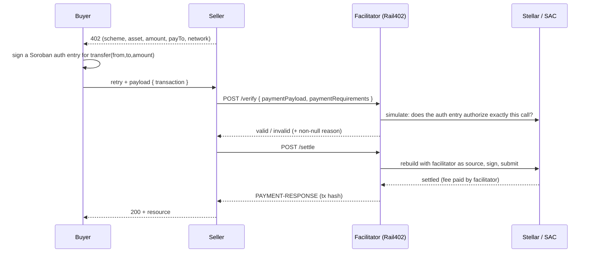

This is where a payment actually moves. The buyer signs a Soroban authorization entry, the facilitator builds a transaction around it and submits it, and the SEP-41 token contract moves the funds. This page describes that path for the `exact` scheme. [The upto scheme](/architecture/upto) covers the metered variant, and [Stellar essentials](/concepts/stellar) is the lighter introduction.

## Auth entries, not pre-signed transactions

On Stellar, x402 does not work by having the buyer pre-sign a whole transaction. The buyer signs a **Soroban authorization entry** under Stellar's authorization framework (CAP-46): a signed commitment that a specific contract invocation, a `transfer(from, to, amount)` on the payment asset's Stellar Asset Contract (SAC), is authorized, and nothing else. The facilitator builds and submits the transaction that carries that entry.

This split is the whole reason fee sponsorship and the non-custodial property are possible. The buyer authorizes the *transfer*, and the facilitator owns the *transaction*.

## The endpoint surface

The facilitator is a [Hono](https://hono.dev) app (`apps/facilitator/src/app.ts`) exposing the standard x402 surface, `/supported`, `/verify`, and `/settle`, plus `/health`, `/metrics`, and the `/discovery/*` Bazaar routes. Middleware order is deliberate: the body is parsed before the auth check runs, so a per-network authentication exemption (testnet is open) can read the request's network before deciding.

The HTTP layer is thin on purpose. It validates the request shape, calls `facilitator.verify()` or `facilitator.settle()`, and catalogs the result as a side effect. **The Soroban invocation is built and submitted inside the scheme objects**, not in the HTTP handler. Those scheme objects come from a single registry (`facilitator/build.ts`), and `/supported` is derived from the *same* registry, so the facilitator can never advertise a scheme it cannot run, or reject as unsupported a scheme it advertises.

<Note>
Rail402 does not reimplement verify and settle. It instantiates `@x402/stellar`'s `ExactStellarScheme` per network and wraps it. The wrapper below adds reasons and guards; the cryptographic settlement is the upstream package.
</Note>

## The payload format is accepted verbatim

An x402 Stellar payment payload is `{ transaction }`, a base64-encoded XDR transaction envelope. Rail402 accepts that shape exactly as the spec defines it, with no local field renames or "fixed" variants. This is what lets a stock client pay a Rail402 endpoint with no Rail402-specific code.

One guard sits in front of the decode. A string that is valid base64 but not a decodable envelope (for example `"AAAA"`) throws a `TypeError` deep inside the SAC decode path; left alone, that escapes as a retryable HTTP 500. Rail402 checks decodability up front (`isTransactionUndecodable`, `facilitator/scheme.ts`) and returns a non-retryable `invalid_exact_stellar_payload_malformed` with a reason instead. A malformed payload is the client's bug, and telling it to retry forever would be wrong.

## Auth-entry validation

The facilitator accepts an authorization only if it authorizes **exactly** the declared call, asset, amount, and recipient, not replayed, not expired. `@x402/stellar` does this binding correctly: its `validateAuthEntries` requires address-credentialed entries (not source-account credentials), rejects a missing entry, rejects an expiration ledger beyond the allowed window, checks that the payer actually signed, and rejects a wrong asset, wrong recipient, wrong amount, or a facilitator that is itself the payer.

What the package does not do well is explain a rejection. It sets a machine reason on roughly one of its 20 rejection sites and leaves the human-readable message empty on the rest. Because every rejection must carry a non-null reason, Rail402 wraps the scheme in an **enrichment layer** (`EnrichedExactStellarScheme`, `facilitator/scheme.ts`):

<Steps>
  <Step title="It never reimplements the check">
    Verify and settle are delegated to the upstream scheme unchanged. The wrapper only acts on the *result*.
  </Step>
  <Step title="It re-attaches a non-null reason">
    On any failure, the wrapper maps the machine code to a registered, human-legible reason from the [error registry](/reference/errors). No rejection leaves the facilitator with an empty reason.
  </Step>
  <Step title="It recovers the discarded host error, once, off the hot path">
    For the single generic code `invalid_exact_stellar_payload_simulation_failed`, the wrapper re-simulates the already-failed transaction (one extra RPC call, only on a path that has already failed) to recover the host error string the package threw away, then classifies it.
  </Step>
</Steps>

The classifier (`facilitator/classify.ts`) turns raw Soroban host errors into specific codes. SAC error ordinals map to a negative amount, a balance out of range, or a missing trustline; a `__check_auth` refusal maps to `invalid_exact_stellar_payload_account_policy_refused`; a nonce collision (`Error(Auth, ExistingValue)`) maps to a replay; the phrase "signature has expired" maps to an expiration. When attribution is ambiguous, it stays generic rather than guessing, because a wrong specific reason is worse than an honest generic one.

<Tip>
The reason must land in the field a stock client actually reads. On settle, the enrichment layer writes `errorMessage`, the field `@x402/core`'s `x402HTTPResourceServer` surfaces, not only an `extra.reason`. A reason put anywhere else shows up as a bare code in every stock client. This was found by pointing a stock client at the facilitator, not by reading the spec table.
</Tip>

## The non-custodial invariant

The facilitator never takes custody of funds and is never the source of them. The only fund movement any code path can cause is submitting the buyer-signed authorization exactly as authorized.

This is structural, not a policy. In a settlement, the **transfer's `from` is the buyer**, carried inside an address-credentialed auth entry the buyer signed. The **transaction's source is the facilitator**, which pays the fee. Those are two different addresses by construction. If the facilitator ever appeared as a party to the transfer, the `exact` scheme rejects it outright (`…unsupported_credential_type`), because a transfer sourced by the transaction account would use source-account credentials instead of the signed auth entry.

You can see both facts on any settlement. On transaction [`3f6031ed…`](https://stellar.expert/explorer/testnet/tx/3f6031ed4d3d17100992b1e003f9bcc6da51ef684cc1ba402432ae52166a903f) the fee is charged to the facilitator's signer and the transfer `from` is the buyer, a different address. Tampering with the payment (a changed amount, recipient, or asset) changes what was signed, so it fails signature verification and never settles. [The negative tests](/architecture/conformance#every-rejection-carries-a-reason) prove each of these refusals with its own code.

## Where it lives

| Concern | Source |
| --- | --- |
| HTTP surface, verify/settle/supported, cataloging side-effect | `apps/facilitator/src/app.ts` |
| Facilitator registry, per-network scheme wiring, `/supported` derivation | `apps/facilitator/src/facilitator/build.ts` |
| Error enrichment, malformed-payload guard, payer recovery | `apps/facilitator/src/facilitator/scheme.ts` |
| Host-error classification (SAC ordinals, replay, expiry, policy refusal) | `apps/facilitator/src/facilitator/classify.ts` |
| Auth-entry binding (asset/amount/recipient/expiry/signature) | `@x402/stellar` (upstream, Apache-2.0) |

## Next steps

<CardGroup cols={2}>
  <Card title="Fee sponsorship and fee ceilings" icon="hand-holding-dollar" href="/architecture/fees">
    How the facilitator pays the fee, and the ceiling that guards it.
  </Card>
  <Card title="Expiration, replay, and front-running" icon="clock-rotate-left" href="/architecture/expiration-replay">
    Ledger-based validity and the verify-to-settle race.
  </Card>
  <Card title="The upto scheme" icon="gauge" href="/architecture/upto">
    Metered settlement through a Soroban contract.
  </Card>
  <Card title="Verify it yourself" icon="terminal" href="/architecture/proofs">
    Confirm the non-custodial fee source on chain.
  </Card>
</CardGroup>
