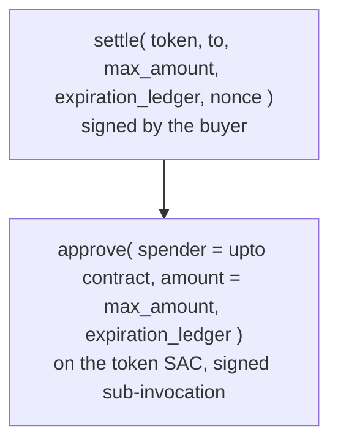

`upto` lets a buyer authorize a spending ceiling and settle only the actual usage. It is the fit for a metered service like token billing, where the price is not known until the work runs. This page is the design and the on-ledger enforcement; [The upto scheme](/concepts/upto) is the lighter conceptual version, and the network spec is drafted for upstream contribution.

Rail402 authored the Stellar `upto` profile. There was an EVM spec and an SVM spec, but no `scheme_upto_stellar.md`, so the design below is that profile.

## Why a contract

The generic `upto` spec mandates four cryptographic guarantees: **single-use** authorization, **time bounds**, **recipient binding**, and **maximum-amount enforcement**. On Stellar a signed auth entry commits to exact invocation arguments, so an `exact`-style `transfer(from, to, amount)` binds the amount at signing time and there is no way to settle it for less. Something has to sit between the buyer's signature and the transfer.

SEP-41 allowances alone cannot be that something. An `approve` / `transfer_from` allowance lets a spender move *up to* an approved amount, which sounds right, but it does not bind the settlement to one recipient and it does not enforce a single settlement: a stale allowance can be drawn more than once, toward any recipient the spender chooses.

So Rail402 ships a minimal Soroban contract. Both existing profiles ship on-chain code (EVM's `x402UptoPermit2Proxy` and SVM's payment-channels program), and a contract-free Stellar profile would be the only one in the ecosystem that fails the generic spec's own MUSTs.

<Warning>
Shipping a contract **widens the audit scope** from an off-chain service and its cryptographic validation to that plus a Soroban contract. This is flagged for the Audit Bank engagement ([Deployment](/architecture/deployment#audit-readiness)). The contract is deliberately tiny (one entry point, no custody, no upgradability, no admin) to keep that scope small.
</Warning>

## The two-node authorization tree

The design's key move is what the buyer signs and what it deliberately leaves unsigned. The buyer, as the transfer's `from`, signs an authorization for a two-node invocation tree:

Every value in that tree is known at signing time. What is **not** signed is `actual_amount` and the settlement `hook`, arguments 7 and 8 of the on-ledger `settle(token, from, to, max_amount, expiration_ledger, nonce, actual_amount, hook)`. Leaving them unsigned is the whole trick: the facilitator can fill in the real usage at settle without invalidating the buyer's signature, because the signature only ever committed to the five values above (via Soroban's `require_auth_for_args`).

At settle:

<Steps>
  <Step title="The facilitator substitutes the actual amount">
    It sets `actual_amount` on the already-signed transaction. This is safe precisely because `actual_amount` is outside the signed tuple, so the substitution changes nothing the buyer committed to.
  </Step>
  <Step title="The contract asserts the ceiling">
    `settle` refuses if `actual_amount > max_amount`. The buyer's authorized ceiling is the hard maximum, enforced on chain.
  </Step>
  <Step title="The contract moves exactly the actual amount">
    Using the signed allowance, the contract calls `transfer_from(spender = self, from = buyer, to, actual_amount)`, bound to the recipient the buyer signed.
  </Step>
</Steps>

The buyer's client builds this transaction against a **null source account**, so the buyer is never the transaction source (which would trigger source-account credentials the facilitator rejects), and signs the auth entries through the SEP-43 wallet interface. This is the same address-agnostic path a [smart account](/architecture/smart-accounts) uses.

<Note>
`upto`'s auth tree has a signed sub-invocation (the `approve`). The `exact` scheme forbids sub-invocations outright, so the two schemes need separate validation paths: Rail402's `upto` validator deliberately permits the sub-invocation, while `exact`'s deliberately does not. Relaxing `exact` to allow sub-invocations would be a security regression, so they stay separate.
</Note>

## The contract guarantees

The contract (`contracts/upto-stellar/src/lib.rs`, 17 Rust tests) enforces four properties on chain:

<CardGroup cols={2}>
  <Card title="Single-use nonce" icon="lock">
    Each nonce is recorded in `temporary()` storage and checked-then-set **before** any transfer. A replayed authorization meets a nonce that is already consumed. This backs the auth-layer replay refusal with a second, independent one.
  </Card>
  <Card title="Ledger-bounded expiration" icon="clock">
    `settle` rejects an `expiration_ledger` in the past (`AuthorizationExpired`) and one beyond `current + NONCE_TTL_LEDGERS` (about 24 hours, `InvalidExpiration`). The upper bound guarantees the nonce record always outlives the authorization it makes single-use.
  </Card>
  <Card title="Zero-amount is still consumed" icon="circle-xmark">
    A settle of `0` consumes the nonce, calls the hook with `0`, and returns before any transfer. Single-use has to mean *used*, so a zero settlement cannot leave the authorization live and re-spendable.
  </Card>
  <Card title="Settlement hook" icon="link">
    After the transfer, the contract calls the buyer's spending policy's `release(from, nonce, actual)`. This is what lets a smart-account budget reconcile from the reserved ceiling down to the real charge.
  </Card>
</CardGroup>

The settlement hook makes `upto` compose with an on-ledger budget rather than only enforce a per-payment ceiling. It is a versioned ABI (`SettlementHook` v1), and it is optional: a plain keypair buyer has no policy, so the hook is `None` and the contract short-circuits it. Reserving a ceiling on chain is the straightforward half; the hook adds the reconciliation that brings the reserved ceiling back down to the actual charge, so an agent's budget reflects real spend rather than the worst case. See [Smart accounts and spending policies](/architecture/smart-accounts) for the reserve-then-reconcile flow it drives.

## Proof

The contract is deployed on testnet and has settled real payments, including in USDC.

| | Value |
| --- | --- |
| Contract | [`CCMM3FMGEH7FHRYXZ3WQDQCTIWDXGZBGW7D4UT7NKH34SUQACYC3U54X`](https://stellar.expert/explorer/testnet/contract/CCMM3FMGEH7FHRYXZ3WQDQCTIWDXGZBGW7D4UT7NKH34SUQACYC3U54X) |
| wasm sha256 | `a19f563e764dfd52a0d229c063e7ac1a1b36f6a976f552a8e19b91ee8e4ef84a` |
| Advertised at | [`/supported`](https://facilitator.rail402.dev/supported), field `extra.uptoContract` |
| `upto` in real USDC | [`1fb4452b…`](https://stellar.expert/explorer/testnet/tx/1fb4452b7a095ffd848896d85aa59e4e3e60db3b90910c3238ade309e11c846e) (0.075 of a 0.20 ceiling) |
| `upto` with budget reconciled | [`0d78d7cf…`](https://stellar.expert/explorer/testnet/tx/0d78d7cf58e4fe3c8cb5821918c88f033618b70f85c7372c3a242572fafae5e9) (750k of a 2M ceiling) |

<Warning>
**Build with `stellar contract build`, not `cargo build`.** The CLI's post-processing (spec-shaking) is part of the deployed bytes; a bare `cargo build --release --target wasm32v1-none` produces a *different* wasm hash that was never deployed. Re-verify the hash after any source change and redeploy if it moves. A source change without a redeploy silently turns a documented guarantee into a description of code that is not running.
</Warning>

## Upstream contribution

`upto` is meant to benefit the whole ecosystem, so both the network spec and the implementation are prepared for upstream. The proposal and the design discussion with SDF engineers are public:

- [`stellar/x402-stellar#71`](https://github.com/stellar/x402-stellar/pull/71), proposing `upto` for Stellar.
- [`stellar/x402-stellar#72`](https://github.com/stellar/x402-stellar/pull/72), the `exact` and `upto` design discussion.

## Next steps

<CardGroup cols={2}>
  <Card title="Smart accounts and spending policies" icon="microchip" href="/architecture/smart-accounts">
    The reserve-then-reconcile budget the hook drives.
  </Card>
  <Card title="Expiration and replay" icon="clock-rotate-left" href="/architecture/expiration-replay">
    The ledger window and single-use enforcement.
  </Card>
  <Card title="Verify it yourself" icon="terminal" href="/architecture/proofs">
    The settled upto transactions on chain.
  </Card>
  <Card title="Meter usage with upto" icon="gauge" href="/sellers/upto">
    Wiring a metered endpoint as a seller.
  </Card>
</CardGroup>
