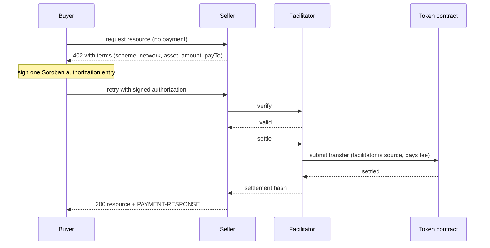

x402 is an HTTP payment protocol: a server answers a request with `402 Payment Required` and terms, the client signs a payment and retries, and a facilitator verifies and settles it on chain before the resource is returned.

This page defines the loop and the words the rest of the docs use. Read it once, and the [buyer](/buyers/quickstart), [seller](/sellers/quickstart), and [operator](/operators/run) paths assume it.

## The loop, step by step

<Steps>
  <Step title="The client requests a resource">
    A buyer (usually software) calls a paid endpoint with no payment attached.
  </Step>
  <Step title="The server answers 402 with terms">
    The response is `402 Payment Required` carrying the payment terms: scheme, network, asset, amount, and the address to pay (`payTo`).
  </Step>
  <Step title="The client signs an authorization">
    The buyer reads the terms and signs a Soroban authorization entry that permits exactly one payment. On Stellar this is an authorization entry, not a whole transaction. See [The exact scheme](/concepts/exact).
  </Step>
  <Step title="The client retries with the payment attached">
    The buyer repeats the request, this time carrying the signed authorization.
  </Step>
  <Step title="The facilitator verifies">
    The seller's payment middleware calls the facilitator's `/verify`. The facilitator checks that the authorization signs exactly the declared call, asset, amount, and recipient, is not replayed, and is not expired.
  </Step>
  <Step title="The facilitator settles">
    The middleware calls `/settle`. The facilitator builds the transaction, sets its own account as the source, pays the network fee, and submits the transfer on chain.
  </Step>
  <Step title="The server returns the resource">
    Settlement succeeds and the server returns the paid response, with the settlement hash in the `PAYMENT-RESPONSE` header.
  </Step>
</Steps>

The buyer never calls the facilitator directly. The seller's middleware does, on the buyer's retried request.

## The four roles on stage

Every payment involves the same four participants. The rest of the docs name them without re-introducing them.

<CardGroup cols={2}>
  <Card title="Buyer" icon="user">
    The paying party. Holds the payment asset, signs the authorization, and needs no XLM. Can be a G keypair or a C contract account (see [Stellar essentials](/concepts/stellar)).
  </Card>
  <Card title="Seller" icon="store">
    The resource server. States the terms in the `402`, and is paid at its `payTo` address. Runs payment middleware that talks to the facilitator.
  </Card>
  <Card title="Facilitator (sponsor)" icon="building-columns">
    Verifies and settles. It is the transaction source and pays the network fee, so the buyer sponsors nothing. It never holds funds (see below).
  </Card>
  <Card title="Token contract" icon="coins">
    The SEP-41 asset's Stellar Asset Contract (SAC). The authorization permits one `transfer(from, to, amount)` against it. Testnet USDC is the default asset.
  </Card>
</CardGroup>

## The facilitator's three endpoints

A facilitator is the service a seller trusts to check and settle a payment. Rail402 exposes the standard surface.

| Endpoint | What it does |
| --- | --- |
| `/verify` | Checks an authorization without moving funds. Returns valid, or a coded rejection with a non-null reason. |
| `/settle` | Submits the transfer on chain and returns the settlement hash. |
| `/supported` | Lists the schemes and networks the facilitator handles, and the Stellar `extra` contract (including `areFeesSponsored`). |

The live testnet facilitator is `https://facilitator.rail402.dev`. Point a stock, unmodified `@x402/*` client at it and a payment completes with no Rail402-specific code. See the [reference](/reference/packages).

<Note>
The facilitator is non-custodial. The only money movement any code path causes is submitting the buyer-signed authorization exactly as signed. The transfer's `from` is the buyer, and the transaction source is the facilitator. You can confirm this on chain for any settlement in the [Explorer](https://explorer.rail402.dev).
</Note>

## exact and upto

Rail402 settles two schemes. Both use the same loop above. They differ only in what the buyer signs.

<CardGroup cols={2}>
  <Card title="exact" icon="equals" href="/concepts/exact">
    Fixed price. The buyer authorizes exactly the stated amount, and exactly that amount settles. The fit for a fixed-price call.
  </Card>
  <Card title="upto" icon="arrow-up-right-dots" href="/concepts/upto">
    Metered. The buyer authorizes a ceiling, and only the actual usage settles, never more than the ceiling. The fit for a metered service such as token billing.
  </Card>
</CardGroup>

## Next steps

<CardGroup cols={2}>
  <Card title="How it works" icon="diagram-project" href="/start/how-it-works">
    The same loop, from the reader's point of view, with a runnable path.
  </Card>
  <Card title="The exact scheme" icon="equals" href="/concepts/exact">
    Auth entries, ledger-based expiration, and sponsored settlement.
  </Card>
  <Card title="Bazaar" icon="magnifying-glass" href="/concepts/bazaar">
    How a paid endpoint becomes discoverable.
  </Card>
  <Card title="Quickstart" icon="rocket" href="/start/quickstart">
    Complete a settled payment end to end.
  </Card>
</CardGroup>
