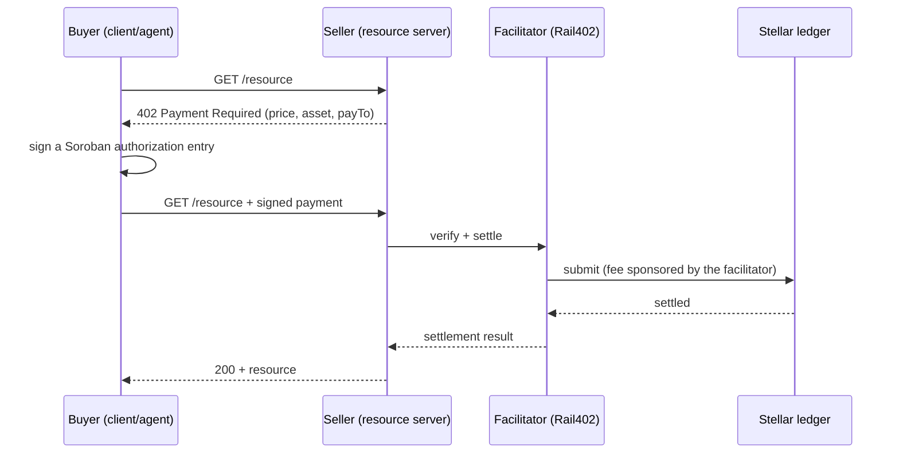

x402 is an open standard for adding per-request payments to HTTP, so an API or service can charge for
a request without a checkout page, a subscription, or a separate billing integration. Rail402 is an
implementation of x402 for Stellar: it verifies and settles those payments, and it catalogs the
services that get paid so agents can find them.

By the end of this page you will know the payment loop, the four addresses involved, and when to use
`exact` versus `upto`. Every guide in these docs assumes these terms.

## The payment loop

<Steps>
  <Step title="Request">
    A client requests a protected resource. It has no payment yet.
  </Step>
  <Step title="402 with terms">
    The server answers `402 Payment Required` with the price, the asset, the network, and the
    address to pay.
  </Step>
  <Step title="Sign">
    The client signs a Soroban authorization entry that permits exactly that one payment. On Stellar
    the client signs an auth entry, not a pre-signed transaction.
  </Step>
  <Step title="Retry">
    The client retries the request with the signed payment attached.
  </Step>
  <Step title="Verify and settle">
    The facilitator verifies the authorization, submits it on-chain, and sponsors the network fee.
  </Step>
  <Step title="Resource">
    The server returns the resource. If the service carried discovery metadata, the facilitator
    catalogs it in the Bazaar.
  </Step>
</Steps>

## The four addresses

A payment involves four parties. Keeping them straight is the single most common point of confusion.

| Address | Who it is | Holds |
|---|---|---|
| **Buyer** | the account that pays, usually an agent | the payment asset (for example testnet USDC) |
| **Seller (`payTo`)** | the account that receives payment | needs a trustline to the asset |
| **Facilitator** | Rail402, which submits and sponsors the fee | XLM for fees; never the buyer's funds |
| **Token contract** | the SEP-41 asset being paid | the on-chain asset, addressed by its contract |

<Note>
  The facilitator is the transaction source and pays the network fee, so the buyer needs only the
  payment asset and no XLM. The facilitator never holds the buyer's funds. It only submits the
  buyer-signed authorization, so tampering with a payment fails signature verification.
</Note>

## exact and upto

Rail402 supports two settlement schemes.

<CardGroup cols={2}>
  <Card title="exact" icon="equals" href="/concepts/exact">
    A fixed price. The buyer authorizes and settles one known amount. Use it for a per-call price.
  </Card>
  <Card title="upto" icon="gauge" href="/concepts/upto">
    Authorize a ceiling, settle the actual usage. Use it for metered services such as token billing.
    A Soroban contract enforces the ceiling on-ledger.
  </Card>
</CardGroup>

## The three surfaces

You interact with Rail402 through one of three surfaces, depending on what you are building.

| Surface | For | Package |
|---|---|---|
| **SDK** | buyers and sellers writing code | [`@rail402.dev/sdk`](/reference/sdk) |
| **CLI** | buyers and agents at a terminal | [`@rail402.dev/cli`](/reference/cli) (`rail402`) |
| **MCP server** | agents paying from inside a runtime | [`@rail402.dev/mcp-discovery`](/buyers/mcp) |

## Next steps

<CardGroup cols={2}>
  <Card title="Install and first payment" icon="rocket" href="/start/quickstart">
    Make a real testnet payment in five minutes.
  </Card>
  <Card title="Stellar essentials" icon="star" href="/concepts/stellar">
    Trustlines, SEP-41 assets, 7-decimal amounts, and smart accounts.
  </Card>
</CardGroup>
